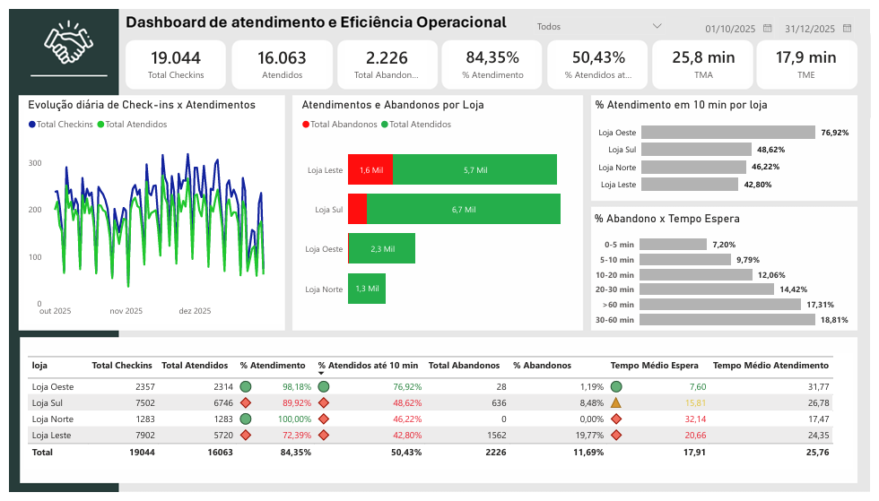
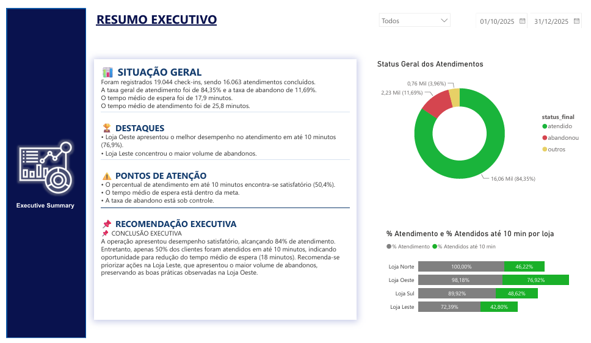

# 📊 Dashboard de Atendimento e Eficiência Operacional


Dashboard desenvolvido para demonstrar a aplicação de Business Intelligence na análise da eficiência operacional de uma central de atendimento.

O projeto contempla desde a consolidação dos dados utilizando Python, passando pelo processo de ETL, modelagem analítica em Power BI, criação de indicadores estratégicos (KPIs) com DAX e construção de dashboards voltados ao apoio da tomada de decisão.

---

## 📷 Dashboard Operacional

O Dashboard Operacional apresenta uma visão completa da eficiência da central de atendimento, permitindo acompanhar em tempo real os principais indicadores da operação.

### Principais análises

- Evolução diária dos check-ins e atendimentos.
- Distribuição de atendimentos e abandonos por loja.
- Percentual de atendimento em até 10 minutos (SLA).
- Distribuição dos abandonos por faixa de tempo de espera.
- Indicadores consolidados da operação.


<p align="center">

</p>

---

# 📌 Sobre o Projeto

Este projeto foi desenvolvido para demonstrar a aplicação de técnicas de Business Intelligence na análise da eficiência operacional de uma central de atendimento.

A solução contempla todo o ciclo analítico, desde a consolidação das bases utilizando Python, passando pelo processo de ETL, modelagem de dados, criação de indicadores estratégicos com DAX e desenvolvimento de dashboards interativos em Power BI.

O objetivo é transformar dados operacionais em informações gerenciais capazes de apoiar a tomada de decisão e identificar oportunidades de melhoria na operação.

---


# 🎯 Objetivos

- Consolidar dados provenientes de múltiplas fontes operacionais.
- Automatizar o processo de ETL utilizando Python.
- Desenvolver uma base analítica padronizada para Business Intelligence.
- Construir indicadores estratégicos (KPIs) utilizando DAX.
- Desenvolver dashboards interativos em Power BI para apoio à tomada de decisão.
- Identificar oportunidades de melhoria por meio da análise de desempenho operacional.

---

# 🛠 Tecnologias Utilizadas

| Tecnologia | Finalidade |
|------------|------------|
| 🐍 Python | Desenvolvimento do pipeline ETL e consolidação das bases de dados |
| 📊 Power BI | Construção dos dashboards e visualizações interativas |
| 📈 DAX | Criação de KPIs, medidas e indicadores estratégicos |
| 🔄 Power Query | Tratamento e transformação dos dados |
| 📄 Excel | Fonte dos dados utilizados no projeto |
| 🗃 Git | Versionamento do projeto |
| 🌐 GitHub | Documentação e disponibilização do portfólio |

---


# 📊 Principais Indicadores (KPIs)

| Indicador | Descrição |
|-----------|-----------|
| 📋 Total de Check-ins | Volume total de atendimentos registrados na operação. |
| ✅ Total de Atendidos | Quantidade de atendimentos concluídos com sucesso. |
| ❌ Total de Abandonos | Clientes que desistiram do atendimento antes da conclusão. |
| 📈 % Atendimento | Percentual de atendimentos concluídos em relação ao total de check-ins. |
| ⏱️ SLA até 10 minutos | Percentual de clientes atendidos em até 10 minutos. |
| ⌛ TME | Tempo Médio de Espera dos clientes na fila. |
| 🕒 TMA | Tempo Médio de Atendimento realizado pelos operadores. |


---


# 📋 Executive Summary

<p align="left">

</p>

O Executive Summary apresenta uma visão gerencial da operação, consolidando automaticamente os principais indicadores de desempenho, destaques, pontos de atenção e recomendações estratégicas geradas dinamicamente por meio de medidas DAX.

Essa página foi desenvolvida para apoiar gestores e lideranças na rápida interpretação dos resultados operacionais, permitindo identificar oportunidades de melhoria e direcionar ações com maior assertividade.

---

## 📂 Estrutura do Projeto

```text
dashboard-atendimento-eficiencia-operacional/
│
├── dashboard/
│   └── Dashboard de Atendimento e Eficiência Operacional.pbix
│
├── images/
│   ├── dashboard-operacional.png
│   └── executive-summary.png
│
├── output/
│   └── base_consolidada.csv
│
├── scripts/
│   └── consolidacao.py
│
├── README.md
├── requirements.txt
└── .gitignore
```
---

## 🔄 Pipeline ETL

O pipeline foi desenvolvido em Python para consolidar automaticamente dados provenientes de múltiplas fontes operacionais, realizando todo o processo de preparação da base analítica utilizada pelo dashboard em Power BI.

### Etapas executadas

1. 📥 Leitura dos arquivos de entrada (CSV, TXT e XLSX);
2. 🔎 Validação da estrutura e padronização das colunas;
3. 📅 Conversão e tratamento de datas e horários;
4. 🧹 Limpeza e tratamento de inconsistências;
5. ⏱️ Cálculo do Tempo Médio de Espera (TME);
6. ⏲️ Cálculo do Tempo Médio de Atendimento (TMA);
7. 📊 Classificação automática dos atendimentos (Atendido / Abandonado);
8. 🏪 Consolidação das informações por loja;
9. 📈 Geração dos indicadores operacionais (KPIs);
10. 💾 Exportação da base consolidada (`base_consolidada.csv`).

---


## ▶️ Como Executar

### 1. Clone o repositório

```bash
git clone https://github.com/sabbrinaa-cloud/dashboard-atendimento-eficiencia-operacional.git
```

### 2. Acesse a pasta do projeto

```bash
cd dashboard-atendimento-eficiencia-operacional
```

### 3. Instale as dependências

```bash
pip install -r requirements.txt
```

### 4. Execute o pipeline ETL

```bash
python scripts/consolidacao.py
```

### 5. Resultado

Ao final da execução será gerada automaticamente a base consolidada:

```text
output/base_consolidada.csv
```

Essa base é utilizada como fonte de dados para o dashboard desenvolvido em Power BI.

---

## 🚀 Próximas Evoluções

O projeto foi estruturado para permitir futuras evoluções e expansão da solução analítica. Entre as melhorias planejadas estão:

- 🔗 Integração com banco de dados SQL Server.
- ☁️ Publicação do dashboard no Power BI Service.
- 🔄 Atualização automática das bases de dados.
- ⏰ Agendamento da execução do pipeline ETL.
- 📈 Inclusão de novos indicadores estratégicos (KPIs).
- 📊 Criação de dashboards táticos e gerenciais complementares.
- 🚨 Implementação de alertas automáticos para indicadores críticos.
- 🤖 Aplicação de modelos preditivos para identificação de tendências operacionais.
- 📱 Desenvolvimento de versão otimizada para dispositivos móveis.
- ⚙️ Integração futura com ferramentas de orquestração de workflows (como n8n ou Apache Airflow).

---

## 👩‍💻 Autora

**Sabrina Sá**

Projeto desenvolvido como demonstração prática de conhecimentos em Python, ETL, Power BI, DAX e Business Intelligence, com foco na construção de soluções analíticas para apoio à tomada de decisão.
